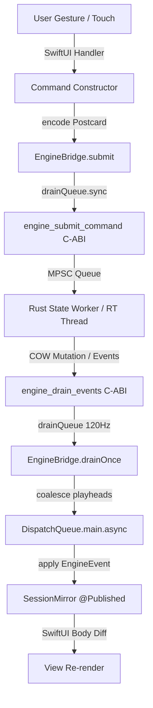

# StepForge Full-Spec MVP App Design Specification

**Date:** 2026-07-23  
**Status:** PROPOSED  
**Target:** Full-Spec MVP SwiftUI Shell for StepForge (`app/StepForge`)  
**References:** `docs/specs/ui-ux-spec.md`, `docs/specs/architecture-spec.md`, `docs/specs/amendments.md`, `docs/handoffs/2026-07-23-app-plan.md`

---

## 1. Overview & Goals

The StepForge engine (Rust `sequencer_engine`) is fully implemented, verified, and merged into `main`. The existing SwiftUI app shell (`app/StepForge/`) implements the core Editing View, kinetic dark theme, step touch gestures, and Postcard binary FFI codec.

This design document specifies the complete architecture, UI component extensions, state flows, and verification strategy to upgrade the SwiftUI shell into a **Full-Spec MVP** covering 100% of the UI/UX specification.

---

## 2. Architectural Adjustments & Engine Bridge Fixes

### 2.1 EngineBridge Thread Safety & Drain Refinements

1. **Mid-Batch Pattern Switch Playhead Clearing (Bug Fix)**:
   - *Issue*: `playheads.removeAll()` currently executes after the FFI drain while-loop completes. If a batch contains `Playhead(t, s)` $\rightarrow$ `PatternSwitched(p)` $\rightarrow$ `Playhead(t, s0)`, the post-loop reset mistakenly clears `Playhead(t, s0)`.
   - *Fix*: In `EngineBridge.drainOnce()`, clear `playheads` immediately inline upon decoding `.patternSwitched`:
     ```swift
     if case .patternSwitched = event {
         playheads.removeAll(keepingCapacity: true)
     }
     ```

2. **`EngineBridge.deinit` Thread Safety (Bug Fix)**:
   - *Issue*: `deinit` currently calls `engine_stop` and `engine_free` directly without `drainQueue.sync`, risking concurrent FFI execution if a drain tick is active.
   - *Fix*: Wrap handle teardown inside `drainQueue.sync`:
     ```swift
     deinit {
         drainTimer?.cancel()
         drainQueue.sync {
             if let h = handle, !didStop { _ = engine_stop(h); }
             if let h = handle { engine_free(h); }
         }
     }
     ```

3. **Optimistic Updates & Mock Bridge**:
   - `MockEngineBridge` will be updated to support optimistic state mutation for all new commands (`setTrackLength`, `setTrackSpeedRatio`, `setTrackNote`, `setMidiDestinations`, `setGlobalMidiChannel`, `setFollowAction`, `queuePattern`, `retriggerPattern`).

---

## 3. UI Component Specifications (Full-Spec MVP)

### 3.1 Editing View Enhancements (`Features/Editing/`)

1. **Track Header Controls (`TrackHeader.swift`)**:
   - **Track Length Control**: Tapping/dragging length badge or opening a mini popover allows setting length window $1..16$. Submits `Command.setTrackLength(trackIdx:length:)`.
   - **Track Speed Ratio Selector**: Tapping the speed badge (e.g. `1x`) presents a menu with options `0.5x`, `1.0x`, `2.0x`, `3.0x`. Submits `Command.setTrackSpeedRatio(trackIdx:ratio:)`.
   - **Note Picker Trigger**: Tapping the drum/note name button opens the `NotePickerSheet`.
   - **Track MIDI Channel / Solo**: Expandable header details for per-track MIDI override/channel info.

2. **Action Drawer Strength Dials (`ActionDrawer.swift`)**:
   - Add strength slider dials ($0.0 .. 1.0$, default $0.6$ for Roll, $0.5$ for Vary) before triggering Roll/Vary actions.
   - Retain `✕ Revert` (submits `Command.undo(trackIdx:)`) and `✓ Keep` affordances.

3. **Feel Bar Addition (`FeelBar.swift`)**:
   - **Pattern Management Button**: Add Patterns button to `FeelBar` (Row 2) to open the 3x3 pattern popover directly from Editing View.

4. **Track List Auto-Scroll (`TrackList.swift`)**:
   - Embed `ScrollViewReader` to automatically scroll to the newest track when `+` Add Track is tapped.

---

### 3.2 Performance Mode View (`Features/Performance/PerformanceView.swift`)

Replace the static placeholder with the complete Performance Mode UI:

1. **Enlarged Top Bar**:
   - Play/Stop button (prominent).
   - Patterns button displaying live loop progress ring (fraction of loops completed towards follow action / 1-bar cycle).
   - Quantize Grain selector (`Next Step`, `Next Beat`, `Next Bar`, `End of Pattern`).

2. **3×3 Pattern Picker Grid**:
   - Displays 9 pattern slots ($0..8$).
   - Visual states:
     - *Empty*: Dim outline.
     - *Filled*: Solid surface.
     - *Currently Playing*: Kinetic accent highlight + circular loop progress ring.
     - *Queued*: Pulsing outline animation.
   - **Gestures**:
     - *Tap Filled*: Submits `Command.queuePattern(index:quantize:)`.
     - *Tap Active*: Submits `Command.retriggerPattern(quantize: .nextBeat)` (or active grain).
     - *Long Press Active*: Submits `Command.retriggerPattern(quantize: .nextStep)` (1/16th note instant retrigger shortcut).
     - *Long Press Filled*: Opens Pattern Options Popover (Duplicate, Clear, Copy, Paste, Edit Follow Action).

3. **Pattern Options & Follow Action Sheet**:
   - Select follow action type (`None`, `Play Next`, `Play Specific`, `Play Previous`, `Stop`, `Play Random`) and loop count `after_loops` ($1..16$).
   - Displays badge (e.g. `→3`) on pattern cell. Submits `Command.setFollowAction(patternIdx:action:)`.

4. **Jam Mode vs. Arrangement Mode Logic**:
   - Mode selector in Performance View.
   - In Jam Mode, default quantize grain is `.nextBeat`; manual pattern queues pause follow-action counters.
   - In Arrangement Mode, default quantize grain is `.endOfPattern`; follow-actions drive progression.

5. **Simplified Track List**:
   - Compact rows showing Track Name, Mute toggle, and real-time Activity LED (flashing on note triggers derived from playhead step hit).
   - Tap row to expand step grid for mid-performance edits.

---

### 3.3 MIDI Device Management & Settings (`Features/Settings/SettingsSheet.swift`)

Replace static placeholder with real CoreMIDI device discovery:

1. **CoreMIDI Manager (`Engine/MidiManager.swift`)**:
   - Wraps Swift `MIDIClientRef` and destination enumeration (`MIDIGetNumberOfDestinations`, `MIDIEndpointGetEntity`, `MIDIObjectGetStringProperty`).
   - Maintains `selectedEndpoints: Set<UInt32>`.
   - Submits `Command.setMidiDestinations(endpoints: Array(selectedEndpoints))` whenever selection changes.

2. **MIDI Devices UI**:
   - Scrollable list of available USB and Network MIDI outputs.
   - Toggle switch for each endpoint (multi-destination routing).
   - Refresh button to re-scan MIDI endpoints.

3. **Global MIDI Channel Selector**:
   - Stepper / Picker ($1..16$, default 10 for GM Drums).
   - Submits `Command.setGlobalMidiChannel(channel:)`.

---

### 3.4 Hybrid Note Picker Sheet (`Features/Editing/NotePickerSheet.swift`)

1. **Header**: Shows current track drum name (e.g. "Kick") and MIDI note number (e.g. "36 / C1").
2. **Segmented Mode Switch**:
   - **View 1: GM Drum Names Grid**: 16 standard GM drum sound tiles (Kick, Snare, Side Stick, Hand Clap, Closed Hat, Open Hat, Low Tom, Mid Tom, High Tom, Crash, Ride, Tambourine, Cowbell, Claves, Shaker, Conga). Tapping assigns MIDI note immediately.
   - **View 2: Piano Roll Keyboard**: Scrollable 2-octave mini piano keyboard with key labels ($C0..B7$). Tapping key plays preview hit & assigns `midi_note`.
3. **Submission**: Submits `Command.setTrackNote(trackIdx:midiNote:)`.

---

## 4. State Flow & Unidirectional Contract



- **Rule 2 Enforcement**: UI holds zero pointers to Rust memory. `SessionMirror` remains a pure value type updated on `@MainActor`.
- **Rule 7 Enforcement**: Swift `MidiManager` owns `MIDIClientRef`; Rust FFI receives integer destination IDs (`[UInt32]`).

---

## 5. Implementation Task Breakdown

The work will be executed across **4 distinct tasks**:

1. **Task 1: FFI Bridge Bug Fixes & Model/Codec Completion**
   - Fix mid-batch pattern switch playhead clearing bug in `EngineBridge.swift`.
   - Fix `deinit` handle teardown thread safety in `EngineBridge.swift`.
   - Update `SessionMirror` and `MockEngineBridge` for full command/event optimistic coverage.

2. **Task 2: Editing Mode Completion (Track Controls, Action Drawer Dials, Note Picker)**
   - Add Track Length control, Speed Ratio menu, and Solo toggle to `TrackHeader.swift`.
   - Add Roll/Vary strength sliders to `ActionDrawer.swift`.
   - Add Tap Tempo to `TransportBar.swift` and Pattern Management button to `FeelBar.swift`.
   - Create `NotePickerSheet.swift` (GM Drum grid + 2-octave piano keyboard).
   - Add `ScrollViewReader` auto-scroll to `TrackList.swift`.

3. **Task 3: MIDI Devices Manager & Settings Sheet**
   - Create Swift `MidiManager.swift` using CoreMIDI C APIs to enumerate destinations.
   - Build interactive `SettingsSheet.swift` with endpoint multi-select toggles and Global MIDI Channel picker.

4. **Task 4: Performance View & Pattern Jamming Engine**
   - Implement `PerformanceView.swift` with enlarged top bar and 3x3 pattern grid.
   - Implement pattern queueing, retrigger gestures (including 1/16th long-press shortcut), pulsing/playing visual states, and loop progress rings.
   - Implement Pattern Options Popover & Follow Action configuration sheet.
   - Implement Jam vs. Arrangement mode logic.
   - Implement simplified track rows with real-time activity LED indicators.

---

## 6. Verification & Test Plan

1. **Unit & Codec Tests (`PostcardTests.swift` + `EngineBridgeTests.swift`)**:
   - `xcodebuild test -scheme StepForge -sdk iphonesimulator`.
   - Verify all Postcard roundtrips pass.
   - Verify `EngineBridge` drain, playhead coalescing, and stop/free lifecycle tests pass.

2. **Build Verification**:
   - `cd app && xcodegen generate && xcodebuild -project StepForge.xcodeproj -scheme StepForge -sdk iphonesimulator -derivedDataPath build CODE_SIGNING_ALLOWED=NO build`.
   - Guarantee `** BUILD SUCCEEDED **` with zero errors.

3. **Engine Integration Verification**:
   - `cd engine && export PATH="$HOME/.cargo/bin:$PATH" && cargo test`.
   - Guarantee 100% green engine unit & FFI tests.
